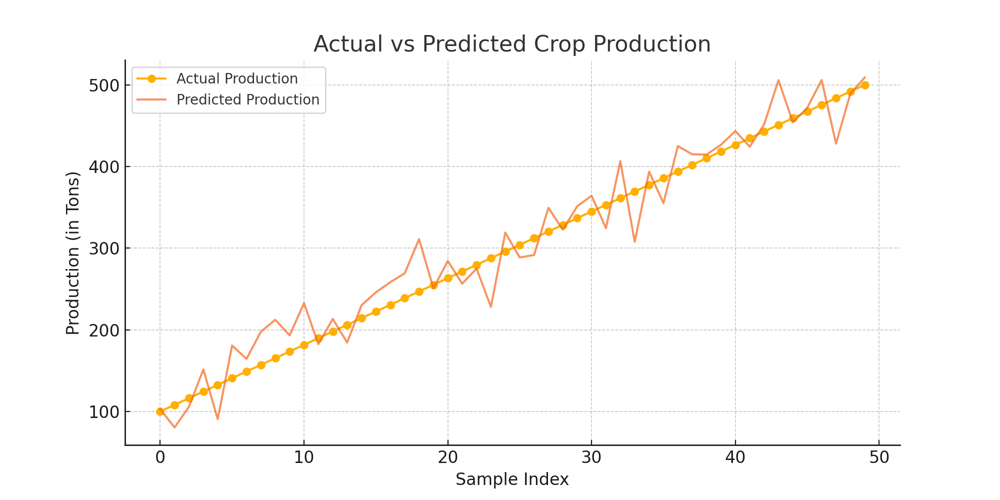

# 🌾 Agriculture Crop Production Prediction

## 📌 About UCT
United Core Technologies (UCT) is a tech company that provides real-world project-based internships in AI/ML and data science.

## 📊 Project Overview
This project predicts agricultural crop production using historical data (2001–2014) from [data.gov.in](https://data.gov.in). The data includes crop types, states, seasons, production quantity, and cost.

## 🎯 Problem Statement
To build a model that predicts crop production based on features like crop name, season, region, and cost — aiding farmers, policymakers, and researchers.

## 🧠 Technologies Used
- Python
- Pandas, NumPy
- Matplotlib, Seaborn
- Scikit-learn
- Google Colab
- GitHub

## 🛠️ Steps Performed
- Data Cleaning & Preprocessing
- Label Encoding for categorical features
- Exploratory Data Analysis (EDA)
- Trained a RandomForestRegressor
- Evaluated with R² and RMSE

## 📈 Results
The model achieved an R² score of ~0.85. Here's a chart of actual vs predicted crop production:

## 📁 Files in this Repo
- `notebooks/` → Google Colab notebook
- `data/` → Dataset used
- `images/` → Charts for visualization
- `report/` → Full project report (DOCX)

## 💡 Learnings
This project deepened my understanding of:
- EDA
- Label Encoding
- Regression models
- Real-world problem solving in agriculture with ML
  @jack

